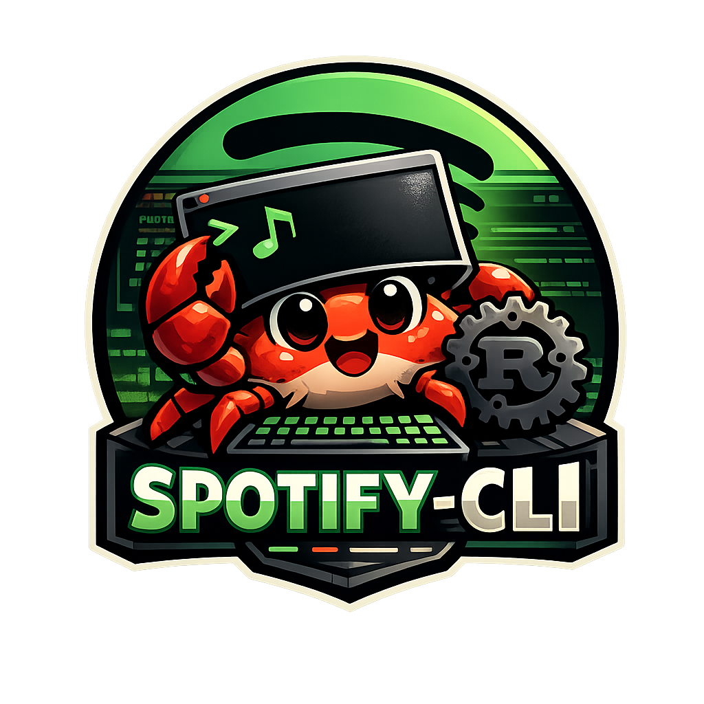

<h1 align="center">
  <br>
  
  <br>
  spotify-cli
  <br>
</h1>

<h4 align="center">A terminal-first Spotify control surface. Search, play, queue, and script.</h4>

<p align="center">
  <a href="#features">Features</a> •
  <a href="#installation">Installation</a> •
  <a href="#authentication">Authentication</a> •
  <a href="#usage">Usage</a> •
  <a href="#commands">Commands</a> •
  <a href="#examples">Examples</a> •
  <a href="#license">License</a>
</p>

<p align="center">
  
  
  
</p>

---

A small, scriptable interface to Spotify that exposes common actions — playback, search, library, and playlist management — as plain shell commands. It doesn't try to replace Spotify's UI, and it doesn't assume how you want to use it. It just runs commands and prints output.

> [!WARNING]
> **Spotify Developer Account Required**
>
> This CLI requires a **Spotify Client ID** from the [Spotify Developer Dashboard](https://developer.spotify.com/dashboard). You'll need to create an app to get your credentials.
>
> **Note:** Spotify has temporarily disabled new developer app registrations (likely in response to the Anna's Archive data breach). If you can't create a new app, you'll need to wait until registration reopens.

> [!CAUTION]
> **API Stability**
>
> The Spotify Web API is known to change without warning, rhyme, or reason. Endpoints may break, rate limits may shift, and features may disappear overnight. This tool does its best to adapt, but it ultimately sits on top of Spotify's APIs and inherits their quirks.

## Features

- **Playback Control** — Play, pause, skip, shuffle, repeat
- **Search** — Find tracks, albums, artists, and playlists
- **Now Playing** — See what's playing, like tracks, add to playlists
- **Queue Management** — View your playback queue and history
- **Playlist Control** — Create, rename, delete, and manage playlists
- **Device Switching** — Switch between Spotify Connect devices
- **Pinned Playlists** — Local shortcuts to your favorite playlists
- **Scriptable Output** — JSON output for piping to `jq`, `fzf`, or other tools

## Installation

### From Source (Cargo)

```bash
cargo install --path .
```

### Local Release Build

```bash
cargo build --release
mkdir -p ~/.local/bin
cp target/release/spotify-cli ~/.local/bin/spotify-cli
```

### Supported Platforms

| Platform | Architecture |
|----------|--------------|
| macOS | Apple Silicon, Intel |
| Linux | x86_64, ARM64 |
| Windows | x86_64 |

## Authentication

### Spotify App Setup

1. Create a Spotify app at the [Developer Dashboard](https://developer.spotify.com/dashboard)
2. Copy the **Client ID**
3. Add a Redirect URI: `http://127.0.0.1:8888/callback`
4. Export as `SPOTIFY_CLIENT_ID` or pass via `--client-id`

### Auth Flow (PKCE OAuth)

```bash
spotify-cli auth login --client-id <client-id>
spotify-cli auth status
spotify-cli auth scopes
spotify-cli auth logout
```

| Command | Description |
|---------|-------------|
| `auth login` | Opens browser for OAuth, starts local callback listener |
| `auth status` | Check authentication status |
| `auth scopes` | View granted OAuth scopes |
| `auth check` | Verify token validity |
| `auth logout` | Log out and clear tokens |

## Usage

### Global Flags

| Flag | Description |
|------|-------------|
| `--json` | Output machine-readable JSON |

### Quick Start

```bash
spotify-cli auth login --client-id <your-client-id>
spotify-cli player toggle          # Play/pause
spotify-cli nowplaying             # What's playing?
spotify-cli search track "Daft"    # Search tracks
spotify-cli queue                  # View queue
```

## Commands

### player

| Command | Description |
|---------|-------------|
| `player play` | Start playback |
| `player pause` | Pause playback |
| `player toggle` | Toggle play/pause |
| `player next` | Skip to next track |
| `player prev` | Previous track |
| `player status` | Current playback status |
| `player shuffle <on\|off>` | Toggle shuffle mode |
| `player repeat <off\|track\|context>` | Set repeat mode |

### nowplaying

| Command | Description |
|---------|-------------|
| `nowplaying` | Display current track info |
| `nowplaying --delay-ms <ms>` | Display with delay (useful for scripts) |
| `nowplaying like` | Like/unlike current track |
| `nowplaying addto [query]` | Add current track to a playlist |

### search

| Command | Description |
|---------|-------------|
| `search [type] <query>` | Search Spotify |
| `search track <query>` | Search tracks |
| `search album <query>` | Search albums |
| `search artist <query>` | Search artists |
| `search playlist <query>` | Search playlists |
| `search [type] --last` | Show cached results |
| `search [type] <query> --play` | Search and play first result |

### info

| Command | Description |
|---------|-------------|
| `info [type] [query]` | Get detailed info |
| `info track` | Current track details |
| `info album [query]` | Album details with track listing |
| `info artist [query]` | Artist information |
| `info playlist [query]` | Playlist details |
| `info [type] [query] --play` | Get info and play |

### playlist

| Command | Description |
|---------|-------------|
| `playlist list` | List your playlists |
| `playlist list --sort <field>` | Sort by: name, owner, public, collaborative |
| `playlist list --owned` | Show only owned playlists |
| `playlist create <name>` | Create new playlist |
| `playlist create <name> --public` | Create public playlist |
| `playlist addto [query]` | Add now-playing to playlist |
| `playlist rename [query] <new>` | Rename a playlist |
| `playlist delete [query]` | Delete a playlist |

### pin

| Command | Description |
|---------|-------------|
| `pin list` | View pinned playlists |
| `pin add <name> <url>` | Pin a Spotify playlist |
| `pin remove <name>` | Remove a pin |

### queue & history

| Command | Description |
|---------|-------------|
| `queue` | View playback queue |
| `queue --limit <n>` | Limit queue results |
| `recentlyplayed` | View recently played |
| `recentlyplayed --limit <n>` | Limit history results |

### device

| Command | Description |
|---------|-------------|
| `device list` | List available devices |
| `device list --live` | Refresh device list from API |
| `device set <name>` | Switch to device |

### sync

| Command | Description |
|---------|-------------|
| `sync` | Sync local cache with Spotify |

## Examples

### Basic Playback

```bash
spotify-cli player play
spotify-cli player pause
spotify-cli player next
spotify-cli player prev
spotify-cli player status
```

### Search and Play

```bash
spotify-cli search artist "The Beatles" --play
spotify-cli search track "Here Comes The Sun"
spotify-cli info album "Revolver" --play
```

### Playlist Management

```bash
spotify-cli playlist list --sort name
spotify-cli playlist create "My New Playlist"
spotify-cli playlist addto "My New Playlist"
spotify-cli pin add "Beatles Essentials" "<spotify-url>"
```

### Scripting with JSON

```bash
spotify-cli nowplaying --json | jq '.track.name'
spotify-cli search track "jazz" --json | jq '.[0].uri'
spotify-cli playlist list --json | jq '.[] | .name'
```

### Composing with Other Tools

```bash
# FZF-powered playlist selection
spotify-cli playlist list --json | jq -r '.[].name' | fzf | xargs -I {} spotify-cli playlist addto "{}"

# Status bar integration
watch -n 5 'spotify-cli nowplaying --json | jq -r ".track.name + \" - \" + .track.artist"'
```

## Cache & Settings

| Path | Description |
|------|-------------|
| `~/.cache/spotify-cli` | Cache root (override with `SPOTIFY_CLI_CACHE_DIR`) |
| `metadata.json` | Tokens and cached data |

Run `spotify-cli sync` to refresh cached playlist and device data.

## Design Philosophy

This project is **CLI-first** by design:

- Scripts can use it
- Editors and tools can shell out to it
- Output can be piped or parsed
- The tool stays small and understandable

No daemon. No custom UI. No assumptions about how it should be used.

## What This Isn't

- A replacement for Spotify's desktop or mobile apps
- A full-featured Spotify client
- A background daemon or always-on service
- A UI or TUI with its own interaction model

## Notes

- `playlist addto` adds the **currently playing track** to the chosen playlist
- The playlist must be writable (owned or collaborative)
- Pins are **local shortcuts**, not Spotify objects
- `--user` flag prefers cached playlists and pins first

## Contributions

Contributions are welcome. Bug fixes, small improvements, and quality-of-life changes are appreciated — especially if they improve reliability or clarity.

The project is intentionally CLI-first, so large architectural changes may not be a good fit. If unsure, open an issue first.

## License

[MIT](LICENSE) - Dheebz
