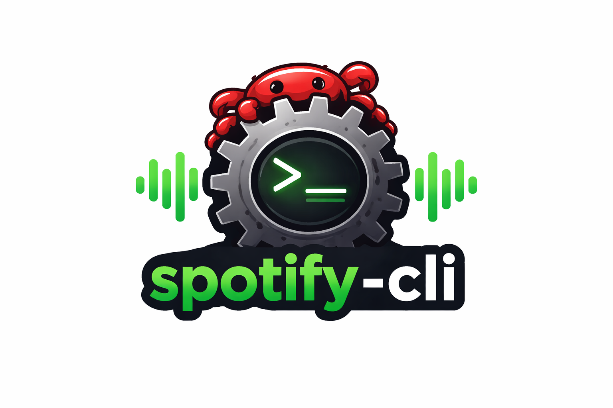

<div align="center">



**Control Spotify from your terminal**

[](https://crates.io/crates/spotify-cli)
[](LICENSE)
[](https://github.com/dheebz/spotify-cli/actions/workflows/ci.yml)

[Installation](#installation) • [Quick Start](#quick-start) • [Commands](#commands) • [Configuration](#configuration)

</div>

---

> [!WARNING]
> **Spotify Developer Account Required**
>
> This CLI requires a Spotify Client ID from the [Spotify Developer Dashboard](https://developer.spotify.com/dashboard). You'll need to create an app to get your credentials.
>
> **Note:** Spotify has temporarily disabled new developer app registrations (likely in response to the Anna's Archive data breach). If you can't create a new app, you'll need to wait until registration reopens.

> [!CAUTION]
> **API Stability**
>
> The Spotify Web API is known to change without warning, rhyme, or reason. Endpoints may break, rate limits may shift, and features may disappear overnight. This tool does its best to adapt, but it ultimately sits on top of Spotify's APIs and inherits their quirks.

---

## Features

- **Playback Control** — Play, pause, skip, seek, volume, shuffle, repeat
- **Library Management** — Save and organize tracks, albums, podcasts, audiobooks
- **Playlist Management** — Create, edit, reorder, follow/unfollow playlists
- **Advanced Search** — Filter by artist, album, year, genre, ISRC, UPC
- **Device Control** — List devices and transfer playback
- **Pin System** — Create shortcuts to frequently used resources
- **JSON Output** — Machine-readable output for scripting
- **RPC Daemon** — JSON-RPC 2.0 over Unix sockets for external control (macOS/Linux only)

## Installation

### From crates.io

```bash
cargo install spotify-cli
```

### From source

```bash
git clone https://github.com/dheebz/spotify-cli.git
cd spotify-cli
cargo build --release
```

### Pre-built binaries

Download from [GitHub Releases](https://github.com/dheebz/spotify-cli/releases/latest).

| Platform | Architecture | Download |
|----------|--------------|----------|
| macOS | Intel | `spotify-cli-*-x86_64-apple-darwin.tar.gz` |
| macOS | Apple Silicon | `spotify-cli-*-aarch64-apple-darwin.tar.gz` |
| Linux | x86_64 | `spotify-cli-*-x86_64-unknown-linux-gnu.tar.gz` |
| Linux | ARM64 | `spotify-cli-*-aarch64-unknown-linux-gnu.tar.gz` |
| Windows | x86_64 | `spotify-cli-*-x86_64-pc-windows-msvc.zip` |
| Windows | ARM64 | `spotify-cli-*-aarch64-pc-windows-msvc.zip` |

### Requirements

- Spotify Premium (required for playback control)
- Rust 1.85+ (if building from source)

## Quick Start

### 1. Create a Spotify App

1. Go to [Spotify Developer Dashboard](https://developer.spotify.com/dashboard)
2. Create a new app
3. Add `http://127.0.0.1:8888/callback` as a Redirect URI
4. Copy your Client ID

### 2. Configure

Create `~/.config/spotify-cli/config.toml`:

```toml
[spotify-cli]
client_id = "your_client_id_here"
```

### 3. Authenticate

```bash
spotify-cli auth login
```

### 4. Play

```bash
spotify-cli player status      # What's playing?
spotify-cli player toggle      # Play/pause
spotify-cli search "Daft Punk" # Find music
spotify-cli player next        # Skip track
```

## Commands

### Aliases

| Command | Alias | Example |
|---------|-------|---------|
| `player` | `p` | `spotify-cli p status` |
| `search` | `s` | `spotify-cli s "query"` |
| `playlist` | `pl` | `spotify-cli pl list` |
| `library` | `lib` | `spotify-cli lib list` |
| `info` | `i` | `spotify-cli i track` |

<details>
<summary><strong>Player subcommand aliases</strong></summary>

| Command | Alias | Example |
|---------|-------|---------|
| `next` | `n` | `spotify-cli p n` |
| `previous` | `prev` | `spotify-cli p prev` |
| `toggle` | `t` | `spotify-cli p t` |
| `status` | `st` | `spotify-cli p st` |
| `volume` | `vol` | `spotify-cli p vol 50` |
| `shuffle` | `sh` | `spotify-cli p sh on` |
| `repeat` | `rep` | `spotify-cli p rep track` |
| `recent` | `rec` | `spotify-cli p rec` |
| `queue` | `q` | `spotify-cli p q list` |
| `devices` | `dev` | `spotify-cli p dev list` |

</details>

### Authentication

```bash
spotify-cli auth login          # Login via browser OAuth
spotify-cli auth login --force  # Force re-authentication
spotify-cli auth logout         # Clear stored tokens
spotify-cli auth status         # Check auth status
```

### Player

```bash
spotify-cli player status       # Current playback info
spotify-cli player toggle       # Play/pause toggle
spotify-cli player play         # Resume playback
spotify-cli player pause        # Pause playback
spotify-cli player next         # Skip to next track
spotify-cli player previous     # Go to previous track
spotify-cli player seek 1:30    # Seek to 1 min 30 sec
spotify-cli player volume 75    # Set volume to 75%
spotify-cli player shuffle on   # Enable shuffle
spotify-cli player repeat track # Repeat current track

# Play specific content
spotify-cli player play --uri spotify:album:xxx
spotify-cli player play --pin "my-playlist"
```

### Search

```bash
spotify-cli search "query"                # Search all types
spotify-cli search "query" --type track   # Search tracks only
spotify-cli search --artist "Beatles"     # Filter by artist
spotify-cli search --year 1990-2000       # Filter by year range
spotify-cli search --genre "rock"         # Filter by genre
spotify-cli search "query" --play         # Play first result
```

### Playlists

```bash
spotify-cli playlist list                       # Your playlists
spotify-cli playlist create "Name"              # Create playlist
spotify-cli playlist add <id> --now-playing     # Add current track
spotify-cli playlist remove <id> spotify:track  # Remove tracks
```

### Library

```bash
spotify-cli library list               # Liked songs
spotify-cli library save --now-playing # Like current track
spotify-cli library remove <id>        # Unlike track
```

### Devices

```bash
spotify-cli player devices list              # List available devices
spotify-cli player devices transfer "iPhone" # Transfer playback
```

### Queue

```bash
spotify-cli player queue list              # Show current queue
spotify-cli player queue add --now-playing # Add current track to queue
```

### Pins

Create shortcuts to frequently used resources:

```bash
spotify-cli pin add playlist <url> "work-music"
spotify-cli pin list
spotify-cli player play --pin "work-music"
```

### Daemon (RPC)

> **Note:** The daemon is only available on macOS and Linux. Windows is not supported due to the use of Unix sockets.

Run a background daemon for external control via JSON-RPC 2.0:

```bash
spotify-cli daemon start   # Start daemon
spotify-cli daemon stop    # Stop daemon
spotify-cli daemon status  # Check if running
```

See [docs/RPC.md](docs/RPC.md) for the full API reference.

## Configuration

Config file: `~/.config/spotify-cli/config.toml` (Windows: `%APPDATA%\spotify-cli\`)

```toml
[spotify-cli]
client_id = "your_spotify_client_id"

[search]
show_scores = true       # Show fuzzy match scores
sort_by_score = false    # Sort by score vs Spotify relevance
```

### File locations

| File | Purpose |
|------|---------|
| `config.toml` | Configuration |
| `token.json` | OAuth tokens |
| `pins.json` | Pinned resources |
| `daemon.sock` | RPC Unix socket (macOS/Linux only) |

### Verbose logging

```bash
spotify-cli -v player status   # Info
spotify-cli -vv player status  # Debug (API calls)
spotify-cli -vvv player status # Trace
```

## Troubleshooting

| Problem | Solution |
|---------|----------|
| Config file not found | Create `~/.config/spotify-cli/config.toml` with your `client_id` |
| No active device | Open Spotify on any device to activate it |
| Token expired | Run `spotify-cli auth login --force` |
| Premium required | Playback control requires Spotify Premium |

## License

MIT OR Apache-2.0
